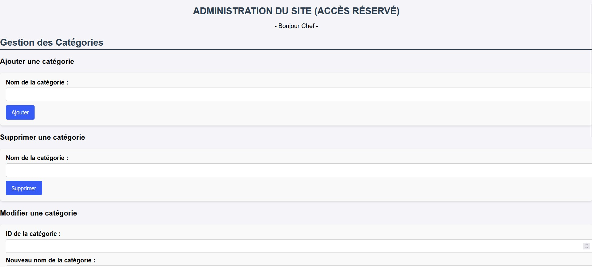
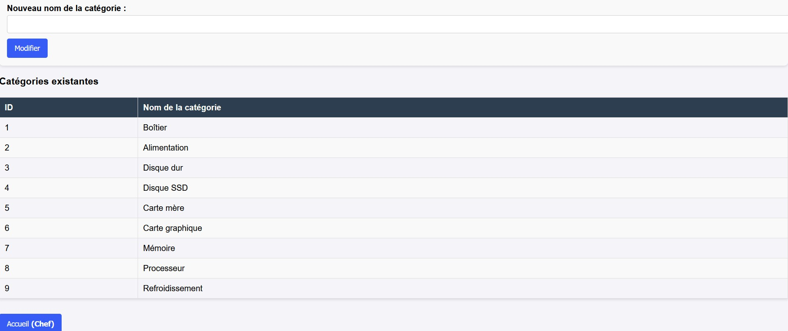
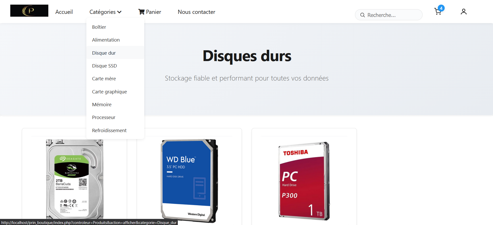
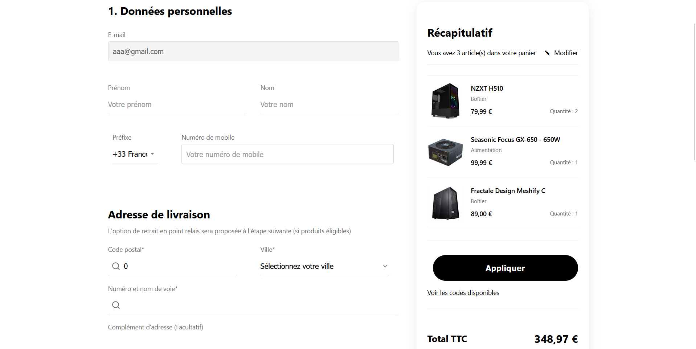
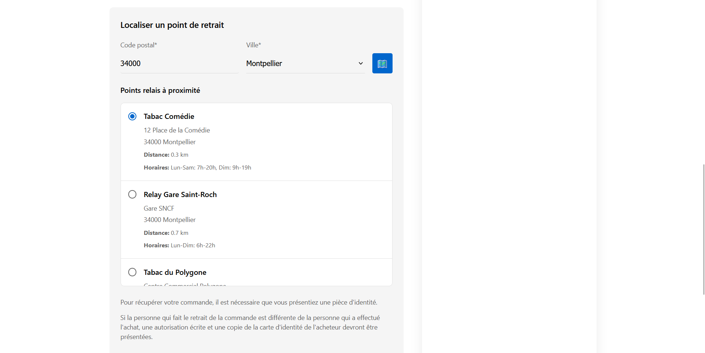
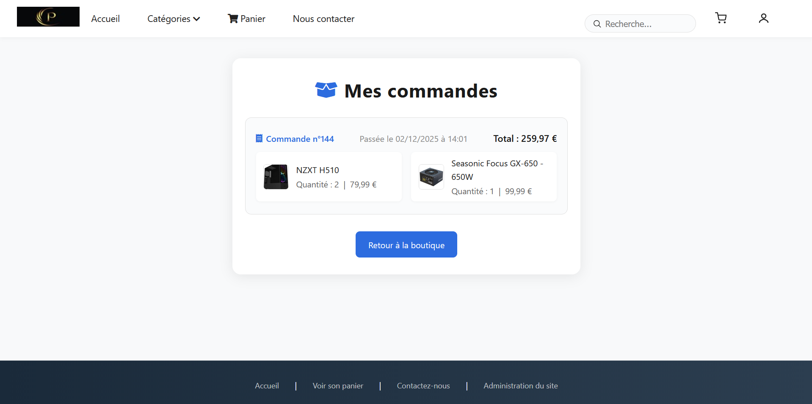

# 🛒 Prin Boutique — Gestion complète de boutique en PHP

Prin Boutique est un projet complet permettant de gérer une boutique en ligne et son back-office, développé sans framework, uniquement en PHP natif, MySQL, HTML/CSS et un peu de Bootstrap.

Ce projet inclut :

- Une interface client (panier, commandes, points relais…)
- Une interface admin (gestion des catégories, produits, commandes, etc.)
- Une base de données complète avec procédures, triggers et fonctions
- Un dossier `docs/` contenant toutes les captures d'écran et schémas nécessaires

## 📁 Arborescence

```
prin_boutique/
│
├── application/
│   ├── controleurs/
│   │   ├── ControleurAdmin.class.php
│   │   ├── ControleurCategories.class.php
│   │   ├── ControleurClient.class.php
│   │   ├── ControleurPanier.class.php
│   │   └── ControleurProduits.class.php
│   │
│   ├── modeles/
│   │   ├── Client.class.php
│   │   ├── gestion_admin.class.php
│   │   ├── gestion_boutique.class.php
│   │   ├── gestion_categorie.class.php
│   │   ├── gestion_client.class.php
│   │   ├── gestion_commande.class.php
│   │   ├── gestion_fournisseur.class.php
│   │   ├── gestion_lignedecommande.class.php
│   │   ├── gestion_panier.class.php
│   │   ├── gestion_produit.class.php
│   │   ├── gestion_utilisateur.class.php
│   │   └── ModelePDO.class.php
│   │
│   └── vues/
│       ├── partie_admin/
│       │   ├── v_acces_interdit.inc.php
│       │   ├── v_adminCategorie.inc.php
│       │   ├── v_connexion_admin.inc.php
│       │   ├── v_index_admin.inc.php
│       │   └── v_stats_produits.inc.php
│       │
│       ├── permanentes/
│       │   ├── v_entete.inc.php
│       │   └── v_pied.inc.php
│       │
│       ├── v_accueil.inc.php
│       ├── v_checkout_adresse.inc.php
│       ├── v_checkout_confirmation.inc.php
│       ├── v_checkout_livraison.inc.php
│       ├── v_checkout_paiement.inc.php
│       ├── v_checkout_recap.inc.php
│       ├── v_confirmation_commande.inc.php
│       ├── v_connexion.inc.php
│       ├── v_erreur404.inc.php
│       ├── v_mes_commandes.inc.php
│       ├── v_modifier_profil.inc.php
│       ├── v_panier.inc.php
│       ├── v_produits.inc.php
│       ├── v_profil_client.inc.php
│       └── v_register.inc.php
│
├── configs/
│   ├── chemins.class.php
│   ├── mysql_config.class.php
│   ├── prin_boutique.sql
│   └── variables_globales.class.php
│
├── docs/
│   ├── assets/              → Captures du site
│   │   ├── accueil.png
│   │   ├── admin_accueil.png
│   │   ├── admin_categorie1.png
│   │   ├── admin_categorie2.png
│   │   ├── categorie_disque_dur.png
│   │   ├── commande_donnees.png
│   │   ├── commande_livraison.png
│   │   ├── commande_paiement.png
│   │   ├── mes_commandes.png
│   │   ├── panier.png
│   │   ├── panier_vide.png
│   │   ├── point_relais.png
│   │   └── recap_commande.png
│   │
│   └── database/
│       ├── fonctions.png
│       ├── procedures.png
│       ├── tables.png
│       └── triggers.png
│
├── public/
│   ├── css/                 → Styles CSS
│   ├── images/              → Images du site
│   ├── js/                  → Scripts JavaScript
│   └── styles/              → Styles additionnels
│
├── libs/                     → Bibliothèques externes (FPDF)
├── vendor/                   → Dépendances Composer
├── index.php                 → Point d'entrée principal
└── README.md                 → Ce fichier
```

## 🖼️ Captures du site

### Page d'accueil


### Accueil Admin


### Gestion des catégories

 

### Page catégorie — Exemple Disques Durs



### Étapes de commande

<div align="center">
  
  
  
</div>

### Panier

<div align="center">
  
  
</div>

### Point relais



### Mes commandes



### Récapitulatif commande


## 🛢️ Base de données

### Tables


### Procédures


### Triggers


### Fonctions


## 🧠 Fonctionnalités principales

### 👤 Côté Client

- ✅ Création de compte / connexion
- ✅ Parcours produits par catégorie
- ✅ Panier dynamique (ajout / suppression / modification)
- ✅ Choix du mode de livraison (dont point relais)
- ✅ Paiement (simulation)
- ✅ Récapitulatif de commande
- ✅ Historique des commandes
- ✅ Gestion du profil utilisateur

### 🔧 Côté Admin (Back-Office)

- ✅ Gestion des catégories (CRUD)
- ✅ Gestion des produits (CRUD)
- ✅ Gestion des commandes
- ✅ Gestion des points relais
- ✅ Dashboard d'accueil admin
- ✅ Statistiques produits
- ✅ Gestion des fournisseurs
- ✅ Gestion des utilisateurs

## 🗄️ Base de données

- Relations entre produits, catégories, commandes, clients…
- Triggers (ex : mise à jour automatique des stocks)
- Procédures stockées (ex : création d'une commande, réapprovisionnement)
- Fonctions SQL (ex : calcul du total d'une commande, nombre de commandes par client)
- Schéma complet dans `docs/database/`

## 🛠️ Technologies utilisées

- **PHP natif** (sans framework)
- **MySQL**
- **HTML / CSS**
- **Bootstrap**
- **JavaScript** (léger)
- **FPDF** (génération de factures)

## ▶️ Installation

### 1. Cloner le repository

```bash
git clone https://github.com/votre-username/prin_boutique.git
```

### 2. Configurer la base de données

1. Importer le fichier SQL :
   ```bash
   mysql -u root -p < configs/prin_boutique.sql
   ```

2. Vérifier et modifier les identifiants dans `configs/mysql_config.class.php` :
   ```php
   private static $serveur = 'localhost';
   private static $base = 'prin_boutique';
   private static $utilisateur = 'root';
   private static $passe = 'votre_mot_de_passe';
   ```

### 3. Placer le projet dans votre serveur local

Exemple avec WAMP :
```
C:\wamp64\www\prin_boutique\
```

Puis accéder à :
```
http://localhost/prin_boutique/
```

### 4. Comptes par défaut

**Admin :**
- Identifiant : `admin` (ou selon votre configuration)
- Mot de passe : (voir dans la base de données)

**Client :**
- Créer un compte via l'interface d'inscription

## 📄 Dossier docs/

Ce dossier contient toutes les preuves, schémas et captures pour votre rapport ou votre oral, parfaitement organisés :

```
docs/
│── assets/       → toutes les captures du site client/admin
│── database/     → tables, procedures, fonctions, triggers
```

## 🎓 Objectif scolaire

Ce projet démontre :

- ✔ Capacités en développement PHP sans framework
- ✔ Maîtrise d'un back-office complet
- ✔ Mise en place d'une BDD relationnelle avancée
- ✔ Compréhension des triggers / procédures / fonctions SQL
- ✔ Organisation professionnelle avec un dossier docs
- ✔ Architecture MVC (Modèle-Vue-Contrôleur)
- ✔ Gestion de sessions et sécurité
- ✔ Interface utilisateur moderne et responsive

## 📝 Structure MVC

Le projet suit une architecture **MVC (Modèle-Vue-Contrôleur)** :

- **Modèles** (`application/modeles/`) : Gestion des données et accès à la base
- **Vues** (`application/vues/`) : Présentation et interface utilisateur
- **Contrôleurs** (`application/controleurs/`) : Logique métier et routage

## 🔐 Sécurité

- Protection contre les injections SQL (requêtes préparées)
- Validation des données utilisateur
- Gestion des sessions sécurisées
- Hashage des mots de passe

## 📧 Contact

Pour toute question ou suggestion, n'hésitez pas à ouvrir une issue sur GitHub.

---

**Développé avec ❤️ en PHP natif**

